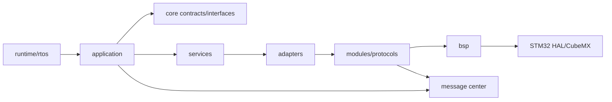

# 全局结构与后续调试说明

这是当前代码的总入口。具体任务边界和未知硬件见
[项目记忆](../project/PROJECT_MEMO.md)，RTOS 细节见 [RTOS 说明](rtos-migration.md)。

## 1. 程序从哪里开始

`Src/main.c` 仍是复位后的入口，负责一次性的板级初始化、云台上电位置锁存、
IMU 校准、应用订阅和通信启动。2026-09-08 核对源码：完成后进入裸机循环，
未调用 `RobotRtos_Start()` 或 `AppRuntime_Step()`。当前循环为：

```text
每轮（末尾 HAL_Delay，实际周期包含执行时间）
  gyro_data_update
  -> CmdController_Task
  -> MsgCenter_Dispatch
       -> chassis / gimbal / shooter 回调
       -> MotorService_Flush（派发结束钩子）
  -> LED 状态更新
  -> 1 Hz CAN 统计（日志限流）
  -> HAL_Delay(CMD_REFRESH_INTERVAL_MS)
```

`runtime/rtos/robot_rtos.c` 保留了未启动的 1 ms 静态控制任务设计，包含可选应用
步进和蜂鸣器更新；它不代表当前执行路径。该设计禁止动态分配任务内存。视觉或日志
只有在测出执行时间、栈和共享状态后，才适合拆成新任务。

## 2. 目录与职责

```text
application/       cmd 路由、底盘、云台、发射业务
  runtime/         可选应用模块的集中登记和生命周期
runtime/rtos/      FreeRTOS 配置、静态任务和调度器启动
core/              状态码、跨层消息、底盘/电机/视觉接口
services/          面向应用的电机与底盘选择服务
adapters/          厂商电机、底盘运动学和视觉传输适配
modules/           算法、设备解析、协议编解码、消息中心
bsp/               当前 STM32 板卡的 CAN/SPI/UART/USB/时间/临界区
config/robots/     两套车型的只读电机和底盘配置
tests/host/        不接开发板即可运行的行为与协议测试
Middlewares/       STM32 中间件和固定版本 FreeRTOS 内核
Src/ Inc/ Drivers/ CubeMX 生成的硬件基线
docs/archive/      历史资料，不作为当前接口依据
```

BSP 全称 Board Support Package（板级支持包）。凡是“这块板使用哪个外设、引脚、
DMA、HAL 句柄”都属于 BSP；CAN ID 含义、反馈字段和控制策略不属于 BSP。

## 3. 依赖方向



规则只有几条：

- 应用不拼 CAN 帧、不访问 HAL、不包含厂商协议头。
- 业务载荷放 `core/contracts/`；线协议结构不能直接进入应用。
- 消息中心只排队和派发，不知道电机、底盘、视觉是什么。
- 电机命令统一走 `MotorService`，底盘几何走 `ChassisStrategy`。
- 未知参数必须在配置校验中失败，不能借用另一厂商默认值。
- 原始 CAN 帧先校验为 8 字节标准数据帧；重复的厂商物理地址/槽位拒绝启动。
- 只有运行时组合根可以同时知道 RTOS 和应用生命周期。

## 4. 遥控器到 CAN 帧怎么读

读完 `main.c` 后建议按以下顺序：

1. `modules/remote/remote_control.c`：DR16 字节如何变成 `RemoteControlMessage`。
2. `core/contracts/remote_messages.h`、`control_messages.h`：模块之间传什么。
3. `application/cmd/cmd_controller.c`：订阅输入、发布三类命令。
4. `application/cmd/command_router.c`：遥控开关、手动/小陀螺/跟随/视觉策略。
5. 目标控制器，例如 `application/chassis/chassis_controller.c`。
6. `services/motor/motor_service.c`：查配置、选择厂商和控制环。
7. `adapters/motor/*_motor_adapter.c`：统一电流如何变成厂商命令。
8. `modules/motor_protocols/`：DM、本末、瓴控的字节排列；DJI 走旧
   `modules/motor/` 与 `modules/can_comm/`。
9. `bsp/can/bsp_can.c`：最后一层 HAL CAN 发送。

反向反馈是 `bsp/can -> CAN_Manager -> TOPIC_CAN_RX -> 厂商 adapter -> snapshot`；
DJI 还会发布旧的标准电机反馈主题供兼容驱动使用。

命令入口记录最后一次 RC 更新；200 ms 没有新帧时，路由器统一发布禁用命令。
小陀螺 yaw 目标按真实毫秒差积分，不依赖控制任务恰好运行在某个固定频率。

## 5. 新增 application 功能

优先使用四类接口：

- 消息：`MsgCenter_Subscribe()` / `MsgCenter_Publish()`；载荷先定义在
  `core/contracts/`，必须小于 128 字节。
- 电机：`MotorService_GetSnapshot()`、`MotorService_CommandCurrent()`、
  `MotorService_CommandConfigured()`；每次检查返回状态。
- 底盘：通过 `ChassisStrategy_Get()` 选择运动学，不在应用写车型分支。
- 生命周期：实现 `AppModule {name, init, step, safe_stop}`，只在
  `application/runtime/app_manifest.c` 增加一项。不要再改 `main.c`。

`init` 只能登记资源和订阅；`step` 不能阻塞；`safe_stop` 必须能让输出回到安全值。
需要新板级 I/O 时先加 BSP 接口，再由模块/适配器使用。

## 6. 底盘状态

| 类型 | 状态 | 修改位置 |
|---|---|---|
| 麦轮 | 已实现并用于步兵 | `adapters/chassis/mecanum_chassis_strategy.c` |
| 现有舵轮 | 保留双舵电机哨兵实现 | `application/chassis/sentry_controller.c` |
| 全向轮 | 安全占位 | 收到轮数、安装角、半径、减速比后实现 strategy |

通用四模块舵轮还缺模块坐标、零位、轮半径、减速比和反转策略。没有这些资料时
不能把现有哨兵实现称为通用舵轮。

## 7. 电机与控制环

`MotorConfig_t.vendor` 选择 DJI、DM、本末或瓴控；`control_mode` 是可调开关：

| 模式 | 含义 |
|---|---|
| `APPLICATION` | 保留当前控制器算出的电流/命令 |
| `DISABLED` | 安全停机；支持失能帧的适配器会使用失能帧 |
| `OPEN_LOOP_CURRENT` | 设定值直接作为协议命令并限幅 |
| `SPEED` | 单速度 PID |
| `POSITION` | 单位置 PID |
| `POSITION_SPEED_CASCADE` | 位置外环、速度内环 |

运行时可用 `MotorService_SetControlMode()` 临时覆盖，
`MotorService_ClearControlModeOverride()` 恢复车型配置；切换会重置 PID。

| 厂商 | 已有代码 | 使用前必须配置 |
|---|---|---|
| DJI | M3508/M2006/GM6020 兼容路径 | CAN ID、方向、PID、限幅 |
| DM | MIT 编解码、反馈、FC/FD 使能状态 | 型号对应 P/V/T 范围、控制/反馈 ID |
| 本末 | BM1505B 0x32/0x33 分组、0x105/0x106 配置 | 地址、反馈 ID、模式、限幅、反馈周期 |
| 瓴控 | 0x280 广播电流、0x141~0x144 反馈 | 厂商工具开启广播模式、限流、编码器分辨率 |

现有两套车型没有配置后三种电机，所以代码不会向它们发帧。第一次实车必须先
`DISABLED` 看反馈，再用极小开环命令核对方向和急停，最后才调 PID。

当前通用 adapter 可用于走 `MotorService_CommandConfigured()` 的驱动/发射角色；
现有云台和哨兵转向仍读取 DJI `MotorContext_t` 的内部状态，尚不能只换配置就改成
DM、本末或瓴控。这是已记录的兼容债务，不能宣称全角色无条件互换。

## 8. 云台上电与视觉

云台等待 yaw/pitch 有效反馈后清 PID，yaw 锁存实际角度；pitch 的 `initial_angle`
非负时作为启动及重新对齐目标，负数则锁存实际角度。步兵 pitch 初始目标为1971，
绝对编码目标限制在1566～2205；启动时反馈或目标越界则双轴零输出。
目标限位不能保证机械位置不因惯性越界；校准回调不会在反馈前输出。
若仍突跳，先看两轴首帧时间、ID、方向和重力补偿，不要先加大 PID。

当前视觉链：

```text
USB CDC/Seasky -> VisionComm -> LegacyVisionBridge
-> VisionTargetMessage -> CommandRouter
```

Jetson 新端口只需解码后发布 `TOPIC_VISION_TARGET`。摄像头算法在 Jetson，MCU
只需要时间戳、坐标系、单位、有效位、CRC/序号和超时规则。型号未知时不得写死
分辨率、内参或帧率。

## 9. 编译、烧录和验证

```bash
cmake -S . -B build/infantry \
  -DCMAKE_TOOLCHAIN_FILE=cmake/gcc-arm-none-eabi.cmake \
  -DROBOT_TYPE=infantry_standard
cmake --build build/infantry --parallel

cmake -S . -B build/sentry \
  -DCMAKE_TOOLCHAIN_FILE=cmake/gcc-arm-none-eabi.cmake \
  -DROBOT_TYPE=sentry_swerve
cmake --build build/sentry --parallel

./tests/host/run_tests.sh
```

产物 ELF 通过 `just flash` 或统一 VS Code 任务，使用推荐的 OpenOCD 写入 STM32F407。
详细步骤见[环境与烧录](../tutorials/setup-guide.md)。主机测试不覆盖 ARM 链接、
中断转接、栈、时序和真实电机，烧录前必须完成两车型 ARM 构建。

## 10. 当前主要问题

- RTOS 未启动，控制、派发和日志仍在裸机循环；执行时间、周期抖动尚未测量。
- 旧 Quaternion EKF 在首次控制周期使用 libc heap 且未检查分配失败；这不属于
  FreeRTOS 动态任务，但必须在链接后核对 RAM，并作为后续静态化工作处理。
- 消息队列满会覆盖旧消息，没有丢包统计。
- 新电机只有协议与主机测试，没有具体型号配置和实车结果。
- 云台和哨兵转向的控制状态仍绑定 DJI 旧上下文，新厂商目前主要兼容统一电机
  服务和可配置的驱动/发射路径。
- 舵轮/全向轮几何、Jetson 新协议、摄像头和标定仍未知。
- gimbal/sentry 仍保留少量 DJI 旧状态读取，是后续兼容债务。
- 两车型 ARM Release 构建和 ELF 静态检查已通过；尚缺上板调度、时序、栈和
  真实执行机构验证。
